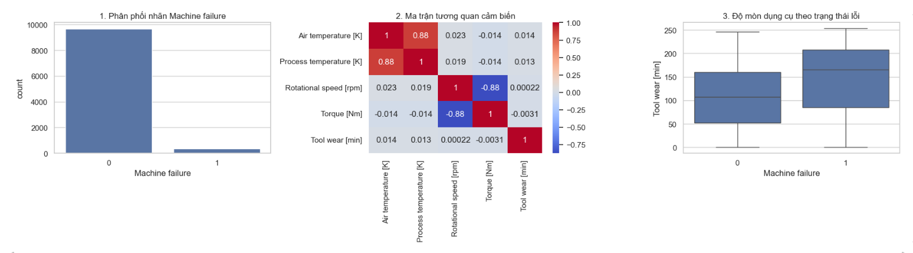
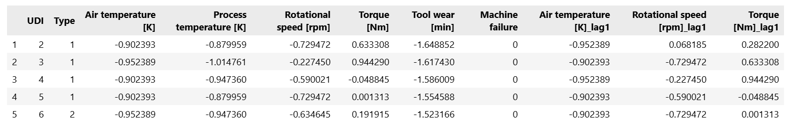
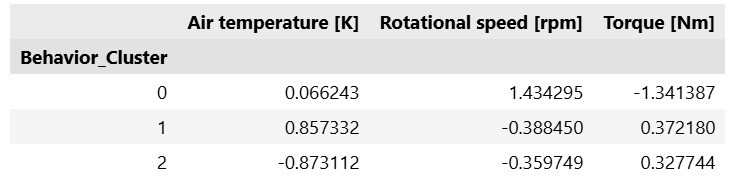
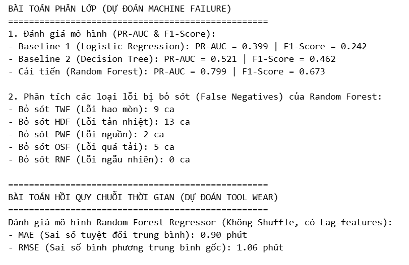
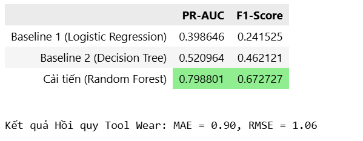
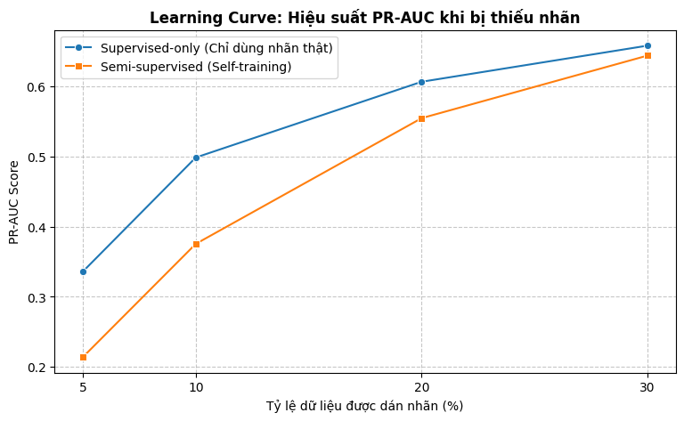
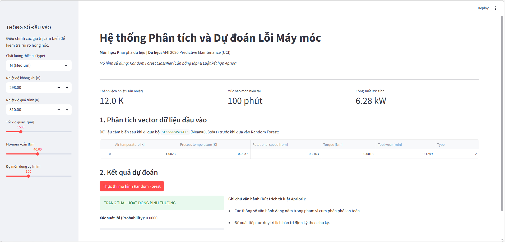

# Data Mining Project - Đề tài 16: Phân tích lỗi sản xuất & dự đoán lỗi

##  Giới thiệu dự án
Dự án này ứng dụng các kỹ thuật Khai phá dữ liệu (Data Mining) và Học máy (Machine Learning) để phân tích hành vi vận hành và dự đoán rủi ro hỏng hóc của máy móc công nghiệp. Hệ thống giúp tối ưu hóa lịch bảo trì, giảm thiểu thời gian chết (downtime) và tiết kiệm chi phí cho nhà máy.

## 1. Nguồn dữ liệu
* **Dataset:** AI4I 2020 Predictive Maintenance Dataset (UCI).
* **Đặc trưng:** Bao gồm 10,000 bản ghi dữ liệu cảm biến (Nhiệt độ không khí, Nhiệt độ quá trình, Tốc độ quay, Mô-men xoắn, Độ mòn dụng cụ).
* **Link tải:** [UCI Machine Learning Repository](https://archive.ics.uci.edu/ml/machine-learning-databases/00601/ai4i2020.csv)
* *Lưu ý: Dữ liệu sẽ được script tự động tải về thư mục `data/raw/` trong lần chạy đầu tiên.*

## 2. Hướng dẫn chạy lại mã nguồn (Reproducible)
**Bước 1:** Cài đặt môi trường và thư viện:
`pip install -r requirements.txt`

**Bước 2:** Chạy các file Notebook theo thứ tự từ `01` đến `05`. Dữ liệu sẽ được tự động tải về thư mục `data/raw/` nhờ script `src/data/loader.py`.

**Bước 3:** Khởi chạy Demo App:
`streamlit run app.py`.

## 3. Quy trình thực hiện (Methodology)
Dự án tuân thủ chặt chẽ quy trình khai phá dữ liệu tiêu chuẩn:
1. **Tiền xử lý & EDA:** Xử lý rủi ro mất cân bằng lớp (Class Imbalance) và ngăn chặn Data Leakage bằng cách loại bỏ các nhãn phụ. Chuẩn hóa dữ liệu bằng `StandardScaler`.
2. **Khai phá tri thức (Data Mining Core):** Áp dụng thuật toán **Apriori** để tìm luật kết hợp giữa các nguyên nhân gây lỗi, và **K-Means** để phân cụm trạng thái hoạt động.
3. **Mô hình hóa (Modeling):** Xây dựng các Baseline (Logistic Regression, Decision Tree) và mô hình cải tiến (**Random Forest**).
4. **Bán giám sát (Semi-supervised):** Thực nghiệm giả lập kịch bản thiếu nhãn (chỉ có 10% - 30% dữ liệu có nhãn) bằng kỹ thuật Pseudo-labeling.

## 4. Kết quả Thực nghiệm & Insight

## A. Phân tích Dữ liệu Khám phá (EDA)

Insight: > * Dữ liệu mất cân bằng nghiêm trọng (Lớp lỗi chiếm tỷ lệ rất nhỏ).

Có sự tương quan nghịch cực mạnh (-0.88) giữa Tốc độ quay (Rotational speed) và Mô-men xoắn (Torque).

Độ mòn dụng cụ (Tool wear) của nhóm máy hỏng cao hơn và phân tán rộng hơn hẳn nhóm bình thường.



## B. Tiền xử lý & Trích xuất Đặc trưng (Feature Engineering)

Dữ liệu được bổ sung các biến lag1 (giá trị của bước thời gian trước đó) nhằm cải thiện khả năng dự báo sớm.



## C. Khai phá Phân cụm (K-Means Clustering)

Kết quả: Hệ thống phân tách thành 3 cụm hành vi vận hành rõ rệt (Silhouette Score: 0.262), tương ứng với các mức tải trọng và nhiệt độ khác nhau (VD: Cụm 0 có tốc độ tua cao, Torque thấp).



## D. Hiệu năng Mô hình Phân lớp & Hồi quy
### 1. Bài toán Phân lớp (Phát hiện lỗi hỏng hóc):
Mô hình Random Forest (Cải tiến) vượt trội hoàn toàn so với các Baseline:

| Mô hình | PR-AUC | F1-Score |
| :--- | :--- | :--- |
| Logistic Regression (Baseline 1) | 0.398 | 0.241 |
| Decision Tree (Baseline 2) | 0.520 | 0.462 |
| Random Forest (Đề xuất) | 0.798 | 0.672 |

Đánh giá rủi ro (False Negatives): Mô hình kiểm soát tốt rủi ro, tuy nhiên vẫn còn bỏ sót 13 ca hỏng do tản nhiệt (HDF) và 9 ca hao mòn (TWF). Tuyệt đối không bỏ sót ca lỗi ngẫu nhiên (RNF) nào.



### 2. Bài toán Hồi quy Chuỗi thời gian (Dự báo số phút hao mòn):

MAE (Sai số tuyệt đối trung bình): 0.90 phút.

RMSE: 1.06 phút.

Mô hình có khả năng bám sát độ mòn thực tế với sai số chưa tới 1 phút!



## E. Thử nghiệm Bán giám sát (Semi-supervised Learning)

Phân tích: Đường cong học tập (Learning Curve) cho thấy diễn biến điểm PR-AUC khi tăng dần tỷ lệ dữ liệu có nhãn. Kỹ thuật Self-Training cho thấy mô hình không sinh ra Báo động giả (False Alarms = 0) ở mức 20% nhãn, minh chứng tính an toàn khi triển khai thực tế.



## F. Giao diện Giám sát Thời gian thực (Dashboard)

Hệ thống được tích hợp thành Web App bằng Streamlit, cho phép kỹ sư nhập liệu đầu vào, tự động chuẩn hóa bằng StandardScaler, đưa ra dự báo trạng thái và gợi ý bảo trì trích xuất từ luật Apriori.



## 5. Cấu trúc Project Repo

Dự án được cấu trúc theo chuẩn module hóa (Industry Standard):

```text
DATA_MINING_PROJECT/
├── configs/          # Chứa tham số cấu hình (params.yaml)
├── data/             # Thư mục chứa dữ liệu
├── notebooks/        # File báo cáo Jupyter Notebook (01 -> 05)
├── outputs/          # Lưu trữ hình ảnh, bảng biểu
├── scripts/          # Script chạy tự động (run_pipeline.py)
├── src/              # Mã nguồn thực thi lõi
├── app.py            # Giao diện Streamlit Dashboard
├── requirements.txt  # Danh sách thư viện môi trường
└── README.md


